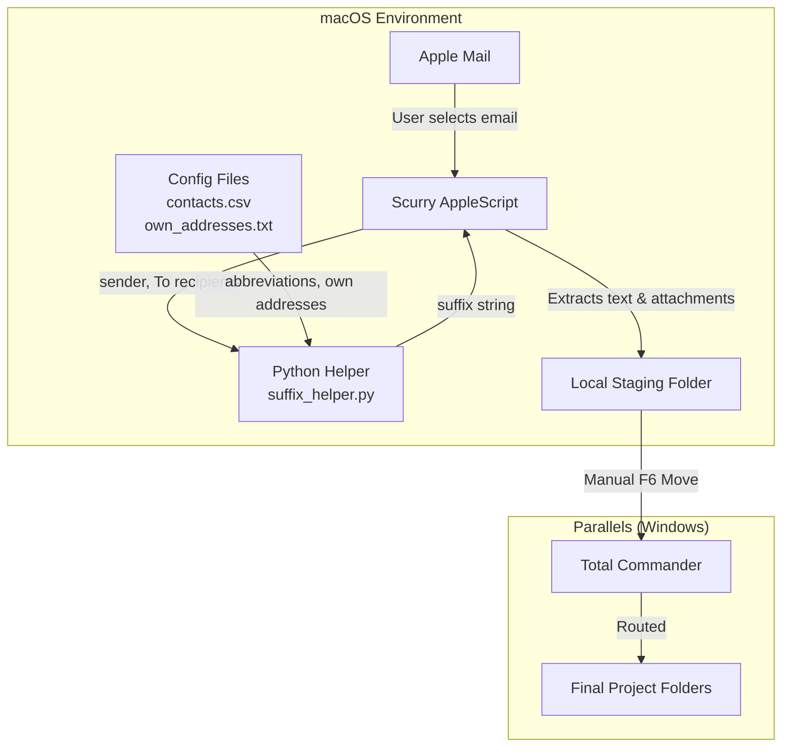

# Scurry

**A minimal macOS automation workbench for script-driven workflows.**

*Scurry* (noun) — "light, running steps": small, fast scripts that run in the background to handle the tedious parts of a workflow.

---

## Vision

Scurry exists to replicate and enhance a legacy Windows/Outlook/VBA macro workflow within the macOS ecosystem. It serves as a workbench for lightweight, highly specific AppleScript automations, starting with a robust Apple Mail extraction tool.

**Core Philosophy:**

* **Hardcoded Reliability**: Configuration lives in code. Scripts should execute instantly without clunky dynamic UI prompts or "Choose Folder" dialogs.
* **Staging over Sorting**: Scurry extracts data to a predictable, hardcoded "staging" directory (mimicking a dedicated `D:` drive). It does not attempt to guess the final project folder. Final routing is performed manually using Total Commander (via Windows Parallels) for maximum speed and control.
* **Non-Destructive**: Scripts are read-only regarding the source application. The Mail extractor will never delete, move, or alter emails within Apple Mail or IMAP. Organization remains a manual, intentional user action.
* **Plain Text First**: Extracted data is stripped of formatting, HTML, and proprietary cruft, ensuring long-term readability and portability.

---

## Architecture

Scurry relies on AppleScript (and occasionally JavaScript for Automation / JXA) to interact directly with macOS application GUIs. This bypasses the need for complex, brittle API authentication (like IMAP App Passwords) by leveraging the applications that are already authenticated on the system.

Python helper scripts handle logic that would be awkward in AppleScript — dictionary lookups, CSV parsing, string manipulation — and are called from AppleScript via `do shell script`.

### Data Flow



---

## The Mail Exporter

The primary macro extracts selected emails from Apple Mail into a structured local directory within the staging folder.

**Status:** Milestones 1–3 complete. Core extraction is fully functional and accessible via keyboard shortcut. Directionality suffixes are fully functional.

### 1. Folder Naming Convention

The script analyzes the selected email and formats the folder name as: `YYMMDD vHHMM Sanitized_Subject [Suffix]`.

* **Timestamp:** Formatted as `YYMMDD vHHMM` (e.g., `2026-05-09 15:33` becomes `260509 v1533`). Date formatting is performed via `do shell script` using the Unix `date` command to avoid locale-dependent AppleScript date handling. The intermediate conversion uses ISO 8601 format via `«class isot»`.
* **Reserved Characters:** Characters invalid in macOS/Windows paths (`: / \ * ? " < > |`) are stripped from the subject. Multiple spaces are collapsed and leading/trailing whitespace is trimmed. Sanitization is performed via a `sed` pipeline in the shell.
* **Directionality Suffix:** A Python helper script (`suffix_helper.py`) is called from AppleScript via `do shell script`. It determines whether the email is incoming or outgoing by checking the sender against a list of own addresses, then looks up abbreviations from a contacts CSV.
    * **Outgoing (Sent):** Appends `(to AB, CD)` based on the abbreviation dictionary. Maximum of 3 To recipients. Unknown recipients are silently dropped. Duplicates are removed. Order is preserved.
    * **Incoming (Inbox):** Appends `(AB)`. The word "to" is omitted. If the sender is unknown, no suffix is added.

**Examples:**
* Outgoing: `260509 v1533 RE This subject it is (to FB)`
* Outgoing, multiple: `260509 v1015 Project Alpha Update (to FB, JD)`
* Incoming: `260509 v1015 Project Alpha Update (FB)`
* Unknown sender/recipients: `260509 v1015 Project Alpha Update`

### 2. Email Text Format (`email.txt`)

The body of the email is saved strictly as plain text. The script prepends metadata headers and appends a list of any downloaded attachments.

**Example Output:**
```text
From: frank.schuhardt@gmail.com
To: foo.bar@bla.com
Cc: rup.rap@bla.com
Bcc:
Subject: RE: This subject it is
Datetime: 2026-05-09 15:33

Hi Foo! Let's go! (please see attachment)

(attached: blubb.xlsx)
(attached: budget_v2.pdf)
```

The file is written using a shell heredoc pattern (`<<'SCURRY_EOF'`) to prevent shell interpolation of email content.

### 3. Attachments

Attachments are downloaded automatically and saved directly into the generated folder alongside the `email.txt` file. This includes inline/pasted images, which Apple Mail exposes as `mail attachments` with auto-generated names (e.g., `image001.png`).

### 4. Configuration

**Project root** is defined at the top of the AppleScript, and the staging directory derives from it:

```applescript
set projectRoot to (POSIX path of (path to home folder)) & "Projects/scurry/"
set stagingRoot to projectRoot & "tmp/"
```

**Abbreviation dictionary** (`data/MailExporter/contacts.csv`): A semicolon-delimited CSV mapping email addresses to short abbreviations. Supports comment lines (starting with `#`) and blank lines. Header row: `address;abbreviation`. Example files are tracked in git as `contacts.example.csv`.

**Own-address list** (`data/MailExporter/own_addresses.txt`): One email address per line. Used to determine directionality — if the sender is in this list, the email is outgoing. Supports comment lines and blank lines. Example file tracked as `own_addresses.example.txt`.

Both config files are gitignored (they contain real email addresses). The example files document the expected format.

All email address matching is case-insensitive.

---

## Project Structure

```text
scurry/
├── macros/                              ← The automation scripts
│   └── MailExporter/
│       ├── export_mail.applescript       ← Core email extraction logic (plain text)
│       └── suffix_helper.py             ← Python helper for directionality suffixes
├── data/                                ← Runtime configuration (gitignored)
│   └── MailExporter/
│       ├── contacts.csv                 ← Abbreviation dictionary (gitignored)
│       ├── contacts.example.csv         ← Example with dummy data (tracked)
│       ├── own_addresses.txt            ← Own email addresses (gitignored)
│       └── own_addresses.example.txt    ← Example (tracked)
├── build/                               ← Compiled .scpt files (generated by `make build`, gitignored)
│   └── MailExporter/
│       └── export_mail.scpt
├── tests/                               ← Test suite (mirrored structure)
│   ├── MailExporter/
│   │   └── test_suffix_helper.py        ← 13 tests for suffix logic, file loading, CLI
│   └── fixtures/
│       └── MailExporter/
│           ├── contacts.csv             ← Test fixture with known mappings
│           └── own_addresses.txt        ← Test fixture with known addresses
├── tools/
│   └── concat_files.py                  ← Filesdump generator for LLM sessions
├── tmp/                                 ← Staging folder for exported emails (gitignored)
├── CHANGELOG.md                         ← Release history
├── CRITICAL_RULES.md                    ← Non-negotiable LLM collaboration rules
├── LLM-instructions.md                  ← AI session context and conventions
├── README.md                            ← You are here
├── TODO.md                              ← Backlog and future directions
├── first-prompt.md                      ← Entry point for new LLM sessions
├── manifest.lst                         ← File list for filesdump generation
├── Makefile                             ← Build and utility targets
└── requirements.txt                     ← Python dependencies (black, pytest)
```

---

## Testing

Scurry uses pytest for automated testing. The test directory mirrors the `macros/` structure to keep tests close to the code they verify.

### Running Tests

```bash
make test
```

This runs the full test suite via `pytest -v`.

### Test Coverage

**`tests/MailExporter/test_suffix_helper.py`** (13 tests):
* **Incoming email logic:** known sender, unknown sender, case insensitivity
* **Outgoing email logic:** 1/2/3/4+ recipients, mixed known/unknown, all unknown, no recipients, deduplication, order preservation, case insensitivity
* **File loading:** comment and blank line handling, case normalisation, CSV parsing
* **CLI integration:** end-to-end smoke tests calling the script as a subprocess

### Test Fixtures

Test fixtures live in `tests/fixtures/MailExporter/` and contain deterministic dummy data (tracked in git). They are copies of the example config files but serve as stable test inputs that won't change when the user updates their real configuration.

---

## Integration & Usage

### Daily Use: Keyboard Shortcut (CapsLock+D)

The primary way to use the Mail Exporter is via a Karabiner Elements keyboard shortcut:

1. Select an email in Apple Mail
2. Press **CapsLock+D** (D for "download")
3. The export runs silently and shows a confirmation dialog with the folder name and attachment count

**Prerequisites:**
- The compiled `.scpt` must be current: run `make build` after any changes to the AppleScript source
- Accessibility permission must have been granted on first run
- `data/MailExporter/contacts.csv` and `own_addresses.txt` must exist (copy from the example files and populate with real data)

**How it works:** A Karabiner Elements `shell_command` rule calls `osascript` on the compiled `.scpt`. The rule is scoped to Apple Mail only via `condition_bundle_ids` (`^com\.apple\.mail$`), so it won't fire in other apps. The rule lives in the Karabiner rules spreadsheet (`rules.xlsx`), managed by the `converter.py` tool — it is not part of the scurry repo.

**Note on Karabiner Elements:** Scurry uses the same Karabiner CapsLock-as-Hyper-key layer that drives 90+ other key mappings (cursor navigation, bracket shortcuts, clip-tools, etc.). This is a proven, reliable mechanism for per-app keyboard shortcuts on macOS. If you've forgotten about this setup, check `rules.xlsx` and `converter.py` in the Karabiner project.

### Running from Script Editor (Development)

Open `macros/MailExporter/export_mail.applescript` in Script Editor, select an email in Apple Mail, and press ▶️ Run. Use Enter/Return to dismiss the confirmation dialog (the OK button may not respond to mouse clicks — this is a known Script Editor quirk).

### Running from Terminal

Compile and run the script directly:

```bash
make build
osascript build/MailExporter/export_mail.scpt
```

Or run the plain-text source directly (useful for debugging — errors print to stderr):

```bash
osascript macros/MailExporter/export_mail.applescript
```

---

## Technical Notes & Gotchas

* **HFS vs. POSIX Paths:** AppleScript natively uses colon-separated HFS paths (`Macintosh HD:Users:name:Desktop:`). Interacting with the Unix shell or standard file systems requires explicit coercion to POSIX paths (`/Users/name/Desktop/`). The `save` command for attachments requires `POSIX file` coercion. Scurry scripts clearly document path coercions to prevent runtime errors.
* **AppleScript Date Parsing:** AppleScript's native date handling is localized and fragile. Scurry converts dates to ISO 8601 via `«class isot»` (a four-character OSType code) and then reformats via `do shell script "date ..."` to ensure consistent output regardless of macOS system region settings.
* **AppleScript File Encoding:** Script Editor saves `.applescript` files in Mac Roman encoding (not UTF-8). Characters like em dashes and the `« »` chevrons in four-character codes are not valid UTF-8. The filesdump generator (`tools/concat_files.py`) handles this with a UTF-8 → Mac Roman fallback. Keep this in mind when processing AppleScript files with other tools.
* **Shell Argument Safety:** All user-controlled data (email subjects, body text) is passed to `do shell script` using `quoted form of` to prevent shell injection. The email.txt heredoc uses single-quoted delimiters (`<<'SCURRY_EOF'`) to prevent variable interpolation.
* **Sender Normalization:** The `sender` property in Apple Mail returns raw RFC 2822 format, which may be `"Name <email>"` or just `"email"`. The script extracts the bare email address by parsing angle brackets when present.
* **Display Dialog Quirk:** In Script Editor, `display dialog` buttons may not respond to mouse clicks. This is a known macOS/Script Editor issue. Use Enter/Return to dismiss (the default button is always set). This is a development-only issue — it does not affect Karabiner-triggered execution.
* **CSV Config Encoding:** The contacts CSV and own-addresses file are read as UTF-8. If editing in German Excel and saving as CSV, ensure UTF-8 encoding is selected (Excel's default "CSV UTF-8" option works). The CSV uses semicolons as delimiters for German Excel compatibility.
