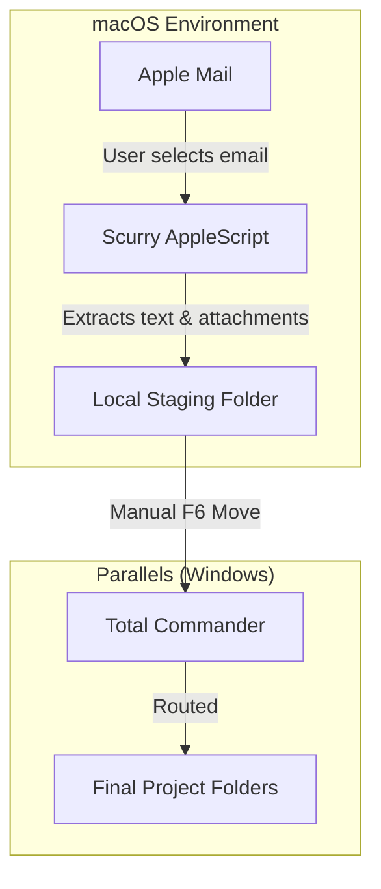

# Scurry

**A minimal macOS automation workbench for script-driven workflows.**

*Scurry* (noun) — "light, running steps": small, fast scripts that run in the background to handle the tedious parts of a workflow.

---

## Vision

Scurry exists to replicate and enhance a legacy Windows/Outlook/VBA macro workflow within the macOS ecosystem. It serves as a workbench for lightweight, highly specific AppleScript automations, starting with a robust Apple Mail extraction tool.

**Core Philosophy:**

* **Hardcoded Reliability**: Configuration lives in code. Scripts should execute instantly without clunky dynamic UI prompts or "Choose Folder" dialogs. 
* **Staging over Sorting**: Scurry extracts data to a predictable, hardcoded "staging" directory (mimicking a dedicated `D:` drive). It does not attempt to guess the final project folder. Final routing is performed manually using Total Commander (via Windows Parallels) for maximum speed and control.
* **Non-Destructive**: Scripts are read-only regarding the source application. The Mail extractor will never delete, move, or alter emails within Apple Mail or IMAP. Organization remains a manual, intentional user action.
* **Plain Text First**: Extracted data is stripped of formatting, HTML, and proprietary cruft, ensuring long-term readability and portability.

---

## Architecture

Scurry relies on AppleScript (and occasionally JavaScript for Automation / JXA) to interact directly with macOS application GUIs. This bypasses the need for complex, brittle API authentication (like IMAP App Passwords) by leveraging the applications that are already authenticated on the system.

### Data Flow



---

## The Mail Exporter (Specification)

The primary macro extracts selected emails from Apple Mail into a structured local directory within the staging folder.

### 1. Folder Naming Convention

The script analyzes the sender to determine directionality and formats the folder name accordingly: `YYMMDD vHHMM Sanitized_Subject (Suffix)`.

* **Reserved Characters:** Characters invalid in macOS/Windows paths (e.g., `:`, `/`, `\`) are stripped from the subject.
* **Timestamp:** Formatted as `YYMMDD vHHMM` (e.g., `2026-05-09 15:33` becomes `260509 v1533`).
* **Directionality (The Suffix):** The script uses a hardcoded list of the user's "own email addresses" to determine if the email is incoming or outgoing.
    * **Outgoing (Sent):** If the sender matches an "own email", it appends `(to AB, CD)` based on a hardcoded abbreviation dictionary. It lists a maximum of 3 recipients. Unknown recipients are dropped.
    * **Incoming (Inbox):** If the sender is NOT the user, it appends `(AB)`. The word "to" is omitted.

**Examples:**
* Outgoing: `260509 v1533 RE This subject it is (to FB)`
* Incoming: `260509 v1015 Project Alpha Update (FB)`

### 2. Email Text Format (`email.txt`)

The body of the email is saved strictly as plain text. The script prepends metadata headers and appends a list of any downloaded attachments.

**Example Output:**
```text
From: frank.schuhardt@gmail.com
To: foo.bar@bla.com
Cc: rup.rap@bla.com
Subject: RE: This subject it is
Datetime: 2026-05-09 15:33

Hi Foo! Let's go! (please see attachment)

(attached: blubb.xlsx)
(attached: budget_v2.pdf)
```

### 3. Attachments
Attachments are downloaded automatically and saved directly into the generated folder alongside the `email.txt` file.

---

## Project Structure

```text
scurry/
├── macros/                          ← The automation scripts
│   └── MailExporter/
│       └── export_mail.applescript  ← Core email extraction logic
├── docs/                            ← Guides and reference
│   └── macOS_integration.md         ← How to bind scripts to keyboard shortcuts
├── CRITICAL_RULES.md                ← Non-negotiable LLM collaboration rules
├── LLM-instructions.md              ← AI session context and conventions
├── README.md                        ← You are here
├── TODO.md                          ← Task list and milestones
├── first-prompt.md                  ← Entry point for new LLM sessions
├── manifest.lst                     ← File list for filesdump generation
├── Makefile                         ← Build and utility targets
└── requirements.txt                 ← Python requirements, for 
```

In case you don't find some of the mentioned folders then treat this as todo/proposal.

Please also refer to the `gentree` output in the `filesdump.txt`.

---

## Integration & Usage

### Running the Scripts
Currently, scripts can be run directly from the macOS **Script Editor** app. 

### Future Integration (Milestone 3)
The goal is to bind these scripts to global keyboard shortcuts so they can be triggered friction-free while Apple Mail is the active window. Potential routing methods include:
* **macOS Shortcuts App:** Wrapping the AppleScript in a Shortcut and assigning a hotkey.
* **Automator Quick Actions:** Accessible via the Services menu.
* **FastScripts / Keyboard Maestro:** Dedicated third-party macro runners.

*(Setup instructions will be documented in `docs/macOS_integration.md` once a method is finalized).*

---

## Technical Notes & Gotchas

* **HFS vs. POSIX Paths:** AppleScript natively uses colon-separated HFS paths (`Macintosh HD:Users:name:Desktop:`). Interacting with the Unix shell or standard file systems requires explicit coercion to POSIX paths (`/Users/name/Desktop/`). Scurry scripts must clearly document path coercions to prevent runtime errors.
* **AppleScript Date Parsing:** AppleScript's native date handling is notoriously localized and fragile. Generating the `YYMMDD vHHMM` string often requires passing the date to a shell script (`do shell script "date..."`) to ensure consistent formatting regardless of macOS system region settings.
