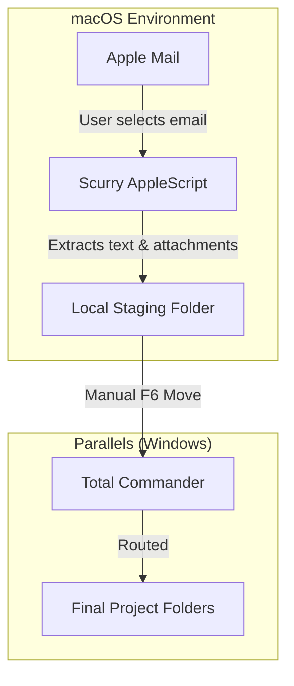

# Scurry

**A minimal macOS automation workbench for script-driven workflows.**

*Scurry* (noun) — "light, running steps": small, fast scripts that run in the background to handle the tedious parts of a workflow.

---

## Vision

Scurry exists to replicate and enhance a legacy Windows/Outlook/VBA macro workflow within the macOS ecosystem. It serves as a workbench for lightweight, highly specific AppleScript automations, starting with a robust Apple Mail extraction tool.

**Core Philosophy:**

* **Hardcoded Reliability**: Configuration lives in code. Scripts should execute instantly without clunky dynamic UI prompts or "Choose Folder" dialogs. 
* **Staging over Sorting**: Scurry extracts data to a predictable, hardcoded "staging" directory (mimicking a dedicated `D:` drive). It does not attempt to guess the final project folder. Final routing is performed manually using Total Commander (via Windows Parallels) for maximum speed and control.
* **Non-Destructive**: Scripts are read-only regarding the source application. The Mail extractor will never delete, move, or alter emails within Apple Mail or IMAP. Organization remains a manual, intentional user action.
* **Plain Text First**: Extracted data is stripped of formatting, HTML, and proprietary cruft, ensuring long-term readability and portability.

---

## Architecture

Scurry relies on AppleScript (and occasionally JavaScript for Automation / JXA) to interact directly with macOS application GUIs. This bypasses the need for complex, brittle API authentication (like IMAP App Passwords) by leveraging the applications that are already authenticated on the system.

### Data Flow



---

## The Mail Exporter

The primary macro extracts selected emails from Apple Mail into a structured local directory within the staging folder.

**Status:** Milestone 1 complete. Core extraction is fully functional. Directionality suffixes (Milestone 2) are not yet implemented.

### 1. Folder Naming Convention

The script analyzes the selected email and formats the folder name as: `YYMMDD vHHMM Sanitized_Subject`.

* **Timestamp:** Formatted as `YYMMDD vHHMM` (e.g., `2026-05-09 15:33` becomes `260509 v1533`). Date formatting is performed via `do shell script` using the Unix `date` command to avoid locale-dependent AppleScript date handling. The intermediate conversion uses ISO 8601 format via `«class isot»`.
* **Reserved Characters:** Characters invalid in macOS/Windows paths (`: / \ * ? " < > |`) are stripped from the subject. Multiple spaces are collapsed and leading/trailing whitespace is trimmed. Sanitization is performed via a `sed` pipeline in the shell.
* **Directionality Suffix (Milestone 2):** The script will use a hardcoded list of the user's "own email addresses" to determine if the email is incoming or outgoing.
    * **Outgoing (Sent):** Appends `(to AB, CD)` based on a hardcoded abbreviation dictionary. Maximum of 3 recipients. Unknown recipients are dropped.
    * **Incoming (Inbox):** Appends `(AB)`. The word "to" is omitted.

**Current examples (Milestone 1):**
* `260509 v1533 RE This subject it is`
* `260509 v1015 Project Alpha Update`

**Future examples (after Milestone 2):**
* Outgoing: `260509 v1533 RE This subject it is (to FB)`
* Incoming: `260509 v1015 Project Alpha Update (FB)`

### 2. Email Text Format (`email.txt`)

The body of the email is saved strictly as plain text. The script prepends metadata headers and appends a list of any downloaded attachments.

**Example Output:**
```text
From: frank.schuhardt@gmail.com
To: foo.bar@bla.com
Cc: rup.rap@bla.com
Bcc:
Subject: RE: This subject it is
Datetime: 2026-05-09 15:33

Hi Foo! Let's go! (please see attachment)

(attached: blubb.xlsx)
(attached: budget_v2.pdf)
```

The file is written using a shell heredoc pattern (`<<'SCURRY_EOF'`) to prevent shell interpolation of email content.

### 3. Attachments

Attachments are downloaded automatically and saved directly into the generated folder alongside the `email.txt` file. This includes inline/pasted images, which Apple Mail exposes as `mail attachments` with auto-generated names (e.g., `image001.png`).

### 4. Configuration

The staging root directory is defined as a variable at the top of the script:

```applescript
set stagingRoot to (POSIX path of (path to home folder)) & "Projects/scurry/tmp/"
```

Change this path to relocate the staging area.

---

## Project Structure

```text
scurry/
├── macros/                          ← The automation scripts
│   └── MailExporter/
│       └── export_mail.applescript  ← Core email extraction logic (plain text)
├── build/                           ← Compiled .scpt files (generated by `make build`, gitignored)
│   └── MailExporter/
│       └── export_mail.scpt
├── tools/
│   └── concat_files.py              ← Filesdump generator for LLM sessions
├── docs/                            ← Guides and reference (to be populated in Milestone 3)
│   └── macOS_integration.md         ← How to bind scripts to keyboard shortcuts (planned)
├── tmp/                             ← Staging folder for exported emails (gitignored)
├── CHANGELOG.md                     ← Release history
├── CRITICAL_RULES.md                ← Non-negotiable LLM collaboration rules
├── LLM-instructions.md              ← AI session context and conventions
├── README.md                        ← You are here
├── TODO.md                          ← Task list and milestones
├── first-prompt.md                  ← Entry point for new LLM sessions
├── manifest.lst                     ← File list for filesdump generation
├── Makefile                         ← Build and utility targets
└── requirements.txt                 ← Python dependencies (black, pytest)
```

---

## Integration & Usage

### Running from Script Editor (Development)

Open `macros/MailExporter/export_mail.applescript` in Script Editor, select an email in Apple Mail, and press ▶️ Run. Use Enter/Return to dismiss the confirmation dialog (the OK button may not respond to mouse clicks — this is a known Script Editor quirk).

### Running from Terminal

Compile and run the script directly:

```bash
make build
osascript build/MailExporter/export_mail.scpt
```

### Running via Keyboard Shortcut (Milestone 3)

The plan is to use an **Automator Quick Action** wrapping `osascript` execution, with a keyboard shortcut assigned via System Settings → Keyboard → Keyboard Shortcuts → Services. This will allow triggering the export while Apple Mail is the active window. Details will be documented in `docs/macOS_integration.md`.

---

## Technical Notes & Gotchas

* **HFS vs. POSIX Paths:** AppleScript natively uses colon-separated HFS paths (`Macintosh HD:Users:name:Desktop:`). Interacting with the Unix shell or standard file systems requires explicit coercion to POSIX paths (`/Users/name/Desktop/`). The `save` command for attachments requires `POSIX file` coercion. Scurry scripts clearly document path coercions to prevent runtime errors.
* **AppleScript Date Parsing:** AppleScript's native date handling is localized and fragile. Scurry converts dates to ISO 8601 via `«class isot»` (a four-character OSType code) and then reformats via `do shell script "date ..."` to ensure consistent output regardless of macOS system region settings.
* **Shell Argument Safety:** All user-controlled data (email subjects, body text) is passed to `do shell script` using `quoted form of` to prevent shell injection. The email.txt heredoc uses single-quoted delimiters (`<<'SCURRY_EOF'`) to prevent variable interpolation.
* **Sender Normalization:** The `sender` property in Apple Mail returns raw RFC 2822 format, which may be `"Name <email>"` or just `"email"`. The script extracts the bare email address by parsing angle brackets when present.
* **Display Dialog Quirk:** In Script Editor, `display dialog` buttons may not respond to mouse clicks. This is a known macOS/Script Editor issue. Use Enter/Return to dismiss (the default button is always set). This is a development-only issue — it will not affect Automator Quick Action execution.
